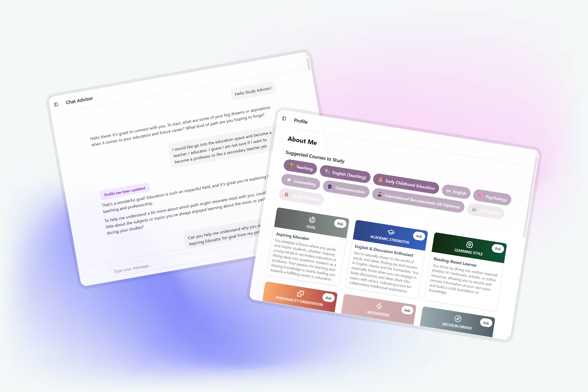
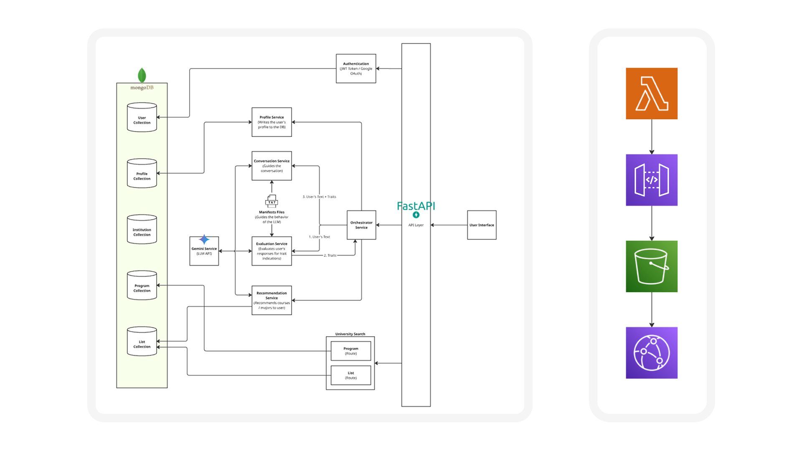

# StudyWat AI 



[](https://studywat.com)
[](https://vialing.com)

## About StudyWat

**StudyWat** is an innovative AI-powered platform that revolutionizes how Malaysian students discover and choose their university programs. By combining cutting-edge artificial intelligence with psychological insights, StudyWat provides personalized recommendations that match students' personality traits, academic preferences, and career aspirations.

### What Makes StudyWat Special?

- **🧠 AI-Powered Personality Analysis**: Advanced algorithms analyze your personality traits to suggest compatible academic paths
- **💬 Interactive Chat Interface**: Natural conversation flow to understand your preferences and goals
- **🎓 Comprehensive University Database**: Extensive database of Malaysian universities and programs
- **😀 Profile Management**: Track your traits, preferences, and academic journey
- **📊 Smart Recommendations**: Personalized suggestions of courses and majors based on your profile
- **🔍 Advanced Filtering**: Find programs by country, university type, ranking, cost, and field of study
- **📱 Modern User Experience**: Beautiful, responsive interface built with the latest web technologies

## Architecture & Tech Stack

### Frontend
- **React 19** with TypeScript
- **Vite** for fast development and building
- **Tailwind CSS** for styling
- **Radix UI** for accessible components
- **React Router** for navigation
- **Axios** for API communication
- **Google OAuth** for authentication

### Backend
- **FastAPI** for high-performance API
- **MongoDB** with Motor for async database operations
- **Google Gemini AI** for intelligent recommendations
- **Python-JOSE** for JWT token handling
- **Mangum** for AWS Lambda deployment
- **Uvicorn** for ASGI server

### Infrastructure
- **AWS Lambda** for serverless deployment
- **AWS S3 / CloudFront** for frontend hosting
- **AWS API Gateway** for API deployment
- **MongoDB Atlas** for cloud database

## App Structure

```
studywat/
├── frontend/                 # React + Vite application
│   ├── src/
│   │   ├── components/       # Reusable UI components
│   │   ├── pages/           # Application pages
│   │   ├── contexts/        # React contexts for state management
│   │   ├── services/        # API service functions
│   │   └── assets/          # Static assets
│   ├── package.json
│   └── vite.config.ts
├── backend/                  # FastAPI application
│   ├── src/
│   │   ├── api/             # API route handlers
│   │   ├── services/        # Business logic services
│   │   ├── models/          # Pydantic models
│   │   ├── clients/         # External service clients
│   │   └── main.py          # FastAPI application entry point
│   ├── data/                # Static data files
│   └── requirements.txt
└── docs/                    # Documentation
```


## API Documentation

### Authentication Endpoints
- `POST /auth/login` - User authentication
- `POST /auth/refresh` - Token refresh
- `GET /auth/me` - Get current user info

### Profile Management
- `GET /api/v1/profile/traits` - Get user personality traits
- `POST /api/v1/profile/update` - Update user profile
- `GET /api/v1/profile/recommendations` - Get personalized recommendations

### University & Programs
- `GET /api/v1/institutions` - List universities
- `GET /api/v1/programs` - Search programs with filters
- `GET /api/v1/program-lists` - Get program categories

### Chat & Recommendations
- `POST /api/v1/orchestrator/chat` - Send message to AI advisor
- `GET /api/v1/recommendation/` - Get AI-powered recommendations

### Health Check
- `GET /health` - API health status

## Authors & Credits

**Built by the Vialing Team**

- **[Khai Hern Low](https://www.linkedin.com/in/khaihernlow/)** - Lead Developer
- **[Ashraf Ahmad Amir](https://www.linkedin.com/in/ashraf-amir-607ab9222/)** - Project Advisor
- **[Alim Ling](https://www.linkedin.com/in/alim-ling-830a3112a/)** - Vialing CEO
- **[Muiz Zulkifli](https://www.linkedin.com/in/muizzulkiflee/)** - Marketing Manager

**Special Thanks** to the Vialing team for the amazing platform and work culture

[Vialing.com](https://vialing.com) | Made with ♡ for Malaysian students  
© 2024 StudyWat by Vialing. All rights reserved.
